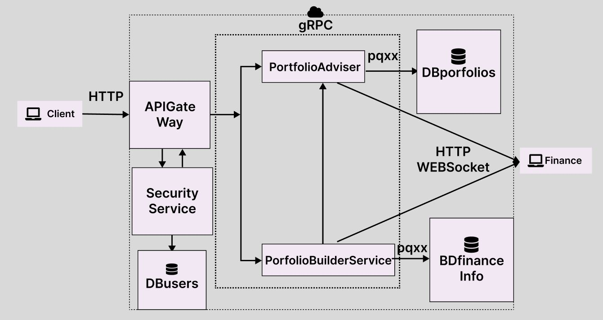

# PortfolioManagementSystem

## Описание
**Portfolio Risk Calculator** — это клиент-сервирное приложение, написанное на C++ для анализа финансового портфеля. Она рассчитывает ключевые метрики, такие как средняя доходность, дисперсия доходности, ковариация, а также предлагает оптимальное распределение активов для минимизации риска, а так же мониторинг состояния портфеля и получения рекомендаций о продаже активов.

---
## Архитектура

Приложение подразумевает клиента, который с помощью http запросов отправляет запрс на сервер и получает ответ. \
Сервис APIGateWay перенапрявляет соответсвующие запросы в различные сервисы используя gRPC. При каждом запросе APIGateWay получает разрешение у SecurityService, который занимается регистрацией и авторизацей а так же парсинга jwt токена.\
Сервис PortfolioAdviser имеет следующие "эндпоинты":
1) загрузка портфеля пользователя из csv файла в базу даннх с портфелями
2) получение информации о портфеле (какие акции возросли в цене, какие упали, какие стоит продать, какие оставить)
3) изменение портфеля
4) добавление в портфель пользователя рекомендованных активов (доступно только для PortfolioBuilder и не имеет эндоинта в APIGateWay)\

Сервис PortfolioBuilder имеет слудующие "эндпоинты":
1) формирование акций по бюджету пользователя с максимальном прогнозом по доходностью
2) формирование акций по бюджета пользователя с минимальным прогназам по рискам 
3) отправление сформированного портфеля в БД

## Функциональность
1. Формирование портфеля аквтивов пользователя исходя из его бюджета и предпочтения выборт стратегии максимайльной прибыли или минимальных рисков
2. Отслеживание портфеля пользователя
3. Получение рекомендаций об активах в портфеле пользователя
4. Загрузка портфеля через CSV файлы
5. Обращение к биржам через запросы и получение актуальных данных для расчетов
6. Микросервисы должны запусткаться в Docker контейнерах, что должно обеспечивать кросс-платформенность
7. При общении между микросервисами должен использовать grpc, для обеспечения быстродействия передачи данных

---

Более подробная версия функциональных требований: [https://drive.google.com/drive/folders/10M9qvc0qdAyTUYz5L3adK55iF75UDG2t](https://drive.google.com/drive/folders/10M9qvc0qdAyTUYz5L3adK55iF75UDG2t?usp=drive_link)

